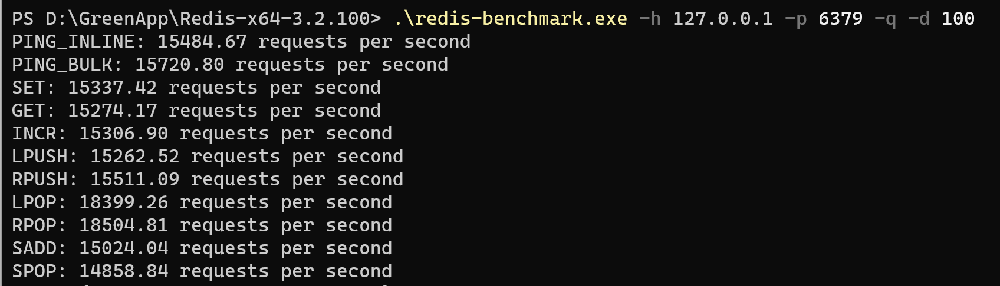
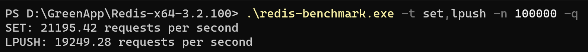
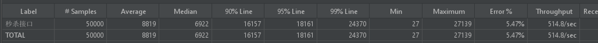
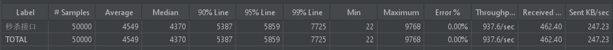
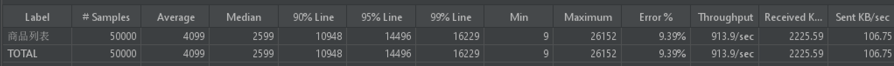
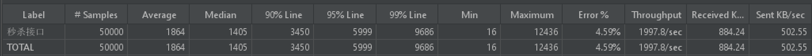

# 高性能高并发商品秒杀系统设计与优化

[TOC]

- #### **[秒杀的特点](#秒杀的特点)**

- #### **[秒杀系统设计思路](#秒杀系统设计思路)**

- #### **[秒杀系统优化方案](#秒杀系统优化方案)**

- #### **[秒杀接口优化](#秒杀接口优化)**

- #### **[超卖问题](#超卖问题)**

- #### **[TODO](#TODO)**

- **[参考资料](#参考资料)**


## **压测报告**

1. redis-benchmark压测redis

    1. -d 100：每次get、set的byte（字节）数

       

      	2. -t 只测试set和lpush，100000个请求

       

2. 压测基准：5000个线程，跑10圈

   1. 获取商品列表
   
      
   
   2. 秒杀
   
       
   
3. 加页面缓存和url缓存

    1. 获取商品列表

        

4. 秒杀接口优化

    1. 第一次请求：秒杀

        1. 启动时将库存量写入redis，用redis预减库存
        2. 当库存减为0的时候，写到本地内存中（用的是一个HashMap）来表示该商品已秒杀完
        3. 再判断是否重复下单：如果没有就发送到消息队列

    2. 消息队列的消费端

        1. 再查数据库判断是否有库存，如果没有，返回
        2. 如果有库存，再从数据库判断是否重复下单，如果重复下单，返回
        3. 如果没有重复下载，就减库存，减库存成功再创建订单
        4. 如果减库存失败，再内存标记该商品已卖完

    3. 第二次请求：查询秒杀结果

        1. 查数据库有没有该用户的该商品的订单，如果有，返回成功
        2. 如果没有，看内存的标记来判断该商品是否已经卖完，如果卖完，返回失败
        3. 其他情况就返回处理中，让前端轮询

        


**总结**

|                     | 商品列表 | 秒杀 |
| ------------------- | -------- | ---- |
| 基准                | 500+     | 900+ |
| 加页面缓存和url缓存 | 900+     |      |
| 页面静态化          |          |      |

压测时遇到的问题，秒杀商品的库存只有10个，在减商品后生成订单，商品数最多只减为-1，但是却会生成1000+的订单。用hashmap进行统计，以调用减库存时的库存量为key，以这个库存量减库存的次数为value，发现差不多每个key的value都是100多，而所有value的sum恰好为订单数。

- 亦即，原因在于每个0~10的库存量被反复用去-1，而由于用户量比较大的原因，订单总是生成新的。

## **springboot打war包并在开发时能以jar包运行**

1. 引入springboot-starter-tomcat依赖provided
2. 引入maven插件
3. 主配置类继承一个initializer然后重写configure方法

## **秒杀的特点**

- 秒杀时大量用户会在同一时间同时进行抢购，网站瞬时访问流量激增。
- 数据库的并发读写冲突以及资源的锁请求冲突非常严重。
- 秒杀一般是访问请求数量远远大于库存数量，只有少部分用户能够秒杀成功。

## **秒杀系统设计思路**

- 分层校验（缓存和流控）：数据库如果使用的是MySQL，最大并发度可以预估为1000左右，缓存系统采用redis的话，最大并发度可以预估为5W左右（[网上数据](https://cloud.tencent.com/developer/news/683174)）。高并发时，秒杀系统最大的瓶颈一般都是数据库读写，所以减少数据库访问和优化数据库语句可以明显的提高系统的QPS。

  

  

- 削峰：对于秒杀系统瞬时会有大量用户涌入，所以在抢购一开始会有很高的瞬间峰值。高峰值流量是压垮系统很重要的原因，所以如何把瞬间的高流量变成一段时间平稳的流量也是设计秒杀系统很重要的思路；

- 可拓展：如果需要支持更多的用户或者更大的并发，将系统设计为弹性可拓展的，如果流量来了，拓展机器就好；

## **秒杀系统优化方案**

- 页面级缓存+URL缓存+对象缓存

- 页面静态化，前后端分离

- 静态资源优化和CDN优化

  1. #### **页面级缓存+URL缓存+对象缓存**


  **页面缓存**，指的是对于服务端的请求，不直接从系统中获取页面资源，而是先从缓存中获取页面资源，如果缓存中不存在页面资源，则系统将渲染页面并存储页面到缓存中，然后将页面返回。

  在商品列表页的请求过程中；请求到服务端，服务端查询数据库中的商品列表信息然后存储在`Model`对象中，`Thymeleaf`页面获取在`Model`对象中的商品列表信息然后动态渲染，再返回给客户端。如果每次请求都做这样的工作，势必会对服务器和系统造成一定的压力（系统的压力主要来源于每次`Thymeleaf`页面获取在`Model`对象的信息都要渲染一次），所以可以做一个页面级的缓存，缓存在redis中，每次直接从`redis`中返回页面信息返回，减轻数据库和系统的压力。

  **URL缓存**，实际上和页面缓存是一样的，在本项目中，我们对商品**详情页**做了缓存，商品详情页的请求需要`goodsId`，也就是说，对每一个`goodsId`都做了一个缓存，其他的和**商品列表页**的缓存思路是一致的，只不过商品取**详情页**是需要动态的根据`goodsId`来取。

  通过上面的缓存差异可知，URL缓存和页面缓存的不同之处在于，URL缓存需要根据URL中的参数动态地取缓存，而页面缓存则不需要。一般来讲，URL缓存和页面缓存的缓存时间都比较短。在本项目中，我们设置**商品详情页**和**商品列表页**的缓存时间为60s。

```java
IWebContext ctx = new WebContext(request, response,
                                 request.getServletContext(), request.getLocale(), model.asMap());
html = thymeleafViewResolver.getTemplateEngine().process("goods_detail", ctx);
```


  **对象缓存**是一种更细粒度的缓存，顾名思义就是对对象就行缓存，在本项目中，我们将`getSeckillUserByPhone`获取的对象进行了缓存，另外，`goodsService.listGoodsVo()`获取的对象也做了一个缓存，减少数据库访问。


编程trick：一个service不能直接使用其他的mapper，只能使用其他service

  2. #### **页面静态化，前后端分离**


  页面静态化指的是将页面直接缓存到客户端。常用的技术有`Angular.js`，`Vue.js`。

  项目中实现方式就是通过`ajax`异步请求服务器获取动态数据，对于非动态数据部分缓存在客户端，客户端通过获取服务端返回的`json`数据解析完成相应的逻辑。

  在本项目中，我们对**商品详情页**和**订单详情页**做了一个静态化处理。

  对于商品详情页，异步地从服务端获取商品详情信息，然后客户端完成页面渲染工作。除此之外，对于秒杀信息的获取也是通过异步获取完成的。例如，当秒杀开始时，用户执行秒杀动作，客户端就会**轮询**服务器获取秒杀结果。而不需要服务器直接返回页面。

  而对于订单详情页，实际上也是同样的思路。

  3. #### **静态资源优化**（未做）

  - JS/CSS压缩，减少流量。客户端完成解压工作。
  - 多个JS/CSS组合，减少连接数。一次TCP连接完成多个HTTP交互。
  - CDN优化。如`jquery.min.js`、`bootstrap.min.css`、`bootstrap.min.js`可以通过此CDN在线获取，减少服务器压力。


**遇到问题**

1. 长整型传到前端后精度丢失，解决方案自定义一个类继承JsonSerializer，然后在属性上使用JsonSerialize注解指定使用哪一个序列化器


## **秒杀接口优化**

- Redis预减库存减少数据库的访问

- 内存标记减少redis访问

- RabbitMQ异步下单，增强用户体验

1. #### **Redis预减库存减少数据库的访问**

核心思想：减少对数据库的访问。

在项目中，我们将商品库存信息存储在redis中，使用redis预减库存，然后异步下单更新数据库中的库存。

**秒杀接口优化思路**：减少数据库的访问

- 系统初始化时，将商品库存信息加载到redis中；
- 服务端收到请求后，redis预减库存，如果库存不足，返回失败，否则则进入下一步；
- 服务端将请求入队，立即返回向客户端返回排队中的信息，提高用户体验；
- 服务端请求出队，从数据库减少库存，如果减库存成功，再生成秒杀订单，；
- 客户端轮询是否秒杀成功。

2. #### **内存标记减少redis访问**

实际上，访问redis也是有网络开销的，所以，在本项目中使用内存标记减少对redis的访问。

具体实现为：

- 定义了一个`HashMap<Integer, Boolean>`，在商品已经秒杀结束时，在`HashMap`中对该商品的库存进行标记，如果库存为小于0，则将该商品标记为已经秒杀结束。每次请求在从redis中读取库存信息前会做一次判断，如果该商品已经秒杀结束，则不用在访问redis中的库存信息，直接返回秒杀失败信息。

3. #### **请求先入队缓冲，异步下单，增强用户体验**

服务器收到秒杀请求后，不是直接访问数据库，而是将请求放置在队列（RabbitMQ）中，这样可以提高用户体验。然后秒杀请求出队，服务器生成秒杀订单，减少缓存中的库存，这就是异步下单的过程。

具体的实现过程为：

- 如果秒杀商品库存尚有且不为重复下单，则生成一条秒杀消息发送到消息队列中（信息中含有用户信息与商品id）；
- 消息的消费者收到秒杀消息后，进行减库存，写入订单信息到数据库中的事务操作。

## **超卖问题**

超卖问题实际上是两个问题：

1. 商品的库存减为负数，也就出现了超卖问题，这是不合理的；
1. 同一个用户秒杀到了两个一样的商品，这种情形也是超卖，应当避免。对userId建立唯一索引

#### **为什么会出现库存超卖？**

**网上很多资料对于出现超卖的的分析感觉都没有抓住重点，特别是使用redis预减库存和中间件异步下单的时候。**

使用redis的`decr`函数进行原子操作预减库存，在没有发生数据丢失和其他异常情况下。可以保证到达数据时减库存和生成订单的请求数肯定刚好等于库存数量，这时候，即使在高并发放的情况下，也不会出现超卖问题。**那么到底是什么原因导致超卖的呢？**

**超卖原因：**

- **项目中使用了rabbitmq中间件，**为保证数据的可靠消费，会开启消费者ACK机制，无论是自动模式或者是手动模式，都有可能出现消息的重复投递。比如自动模式下因为网络延迟导致ack超时或者消费者出现异常时都会重新投递消息。而手动模式下，虽然没有超时限制，但是监听队列发现消费者的 TCP连接或者 channel 关闭了，rabbitmq也会重新投递消息。
- **如果项目中还使用了dubbo框架**，dubbo默认重试机制默认会超时重试次数为2，也就是说因为网络波动或者其他原因发生超时会最多进行3次投递消息，所以也有可能发生消息重复收费。

#### **解决方案：**

- 解决库存超卖

  1. 关闭rabbitmq消费端ack机制。dubbo自动重试次数设置为0.

      该方案可以保证减库存和插入订单数不会操作库存数目。但是该方案会影响系统的高可用性，会导致消息丢失的概率大大增减。并且该方案不符合中间件（rabbitmq）”至少一次“交付的思想。

  2. **在消费端对接口做幂等处理**

- 使用@Transactional注解。将数据库减库存和生成订单放到一个事务中，要么一起成功，要么一起失败自动回滚。	

  ```java
   @Transactional
   @Override
      public OrderInfo seckill(long userId, long goodsId) {
          // 1. 减库存
          goodsService.reduceStock(goodsId);
          // 2. 生成订单；向 order_info 表和 seckill_order 表中写入订单信息
          OrderInfo order = orderService.createOrder(userId,goodsId);
          return order;
      }
  ```

- 创建数据库时对`seckill_order`中的`user_id`和`goods_id`字段创建一个联合**唯一索引**，则在插入两条`user_id`和`goods_id`相同的记录时，将会操作失败，从而事务回滚，秒杀不成功，这就解决了同一个用户发起对一个商品同时发起多次请求引发的超卖问题。

  ```mysql
  UNIQUE KEY `u_uid_gid` (`user_id`, `goods_id`) USING BTREE COMMENT '定义联合索引'
  ```

**思路总结：**

- **使用@Transactional注解**，将减库存和插入订单合并成一个事务操作。
- 数据库`seckill_goods`加唯一**索引**：防止用户重复购买。

## **TODO**

#### **简化秒杀流程**

优化前：

```java
 @RabbitListener(queues = MQConfig.SECKILL_QUEUE)
  public void receiveSkInfo(SkMessage message) {
      logger.info("MQ receive a message: " + message);
      // 获取秒杀用户信息与商品id
      UserVo user = message.getUser();
      long goodsId = message.getGoodsId();
      // 获取商品的库存
      GoodsVo goods = goodsService.getGoodsVoByGoodsId(goodsId);
      Integer stockCount = goods.getStockCount();
      if (stockCount <= 0) {
          return;
      }
      // 判断是否已经秒杀到了（保证秒杀接口幂等性）
      SeckillOrder order = this.getSkOrderByUserIdAndGoodsId(user.getUuid(), goodsId);
      if (order != null) {
          return;
      }
      // 1.减库存 2.写入订单 3.写入秒杀订单
      seckillService.seckill(user, goods);
   }
```

优化后：

```java
 @RabbitListener(queues = MQConfig.SECKILL_QUEUE)
 @RabbitHandler
 public void receiveSkInfo(SkMessage message, Channel channel, Message mes) throws IOException {
     logger.info("MQ receive a message: " + message);
     // 获取秒杀用户信息与商品id
     Long userId = message.getUserID();
     long goodsId = message.getGoodsId();
     // 获取商品的库存
     GoodsVo goods = redisService.get(GoodsKeyPrefix.seckillGoodsInf, ""+goodsId ,GoodsVo.class);
     // 1.减库存 2.写入订单 3.写入秒杀订单
     seckillService.seckill(userId, goods); 
  }
   	 
```

**思路总结：**

1. 删除不必要判断代码。因为使用redis原子操作预减库存和接口幂等处理可以保证不超卖。所以不需要额外判断代码。
2. 系统初始化时使用redis缓存商品信息。秒杀时，减少对数据库的访问操作。

#### **优化数据库语句**

优化前：

```mysql
@Update("UPDATE seckill_goods SET stock_count = stock_count-1 WHERE goods_id=#{goodsId} AND stock_count > 0")
int reduceStack(SeckillGoods seckillGoods);
```

优化后：

```mysql
 @Update("UPDATE seckill_goods SET stock_count = stock_count-1 WHERE goods_id=#{goodsId}")
 int reduceStack(@Param("goodsId") Long goodsId);
```

```mysql
KEY `goods_id` (`goods_id`)
```

**思路总结：**

1. 减库存mysql语句去掉`stock_count > 0`判断。因为使用redis原子操作预减库存和接口幂等处理可以保证达到消费端不同请求书目最多和商品库存数目相同，而`seckill_goods`唯一索引，会让重复请求事务失败，自动回滚，所以不会出现库存小于0.
2. 创建数据库时对`seckill_goods`中`goods_id`加上索引。不加索引，where判断会加表锁，进行全表查询。而加上索引会加行锁，可以提高并发量。

#### **减少据传输大小**

优化前：

```java
seckillService.seckill(user, goods);
```

优化后：

```java
seckillService.seckill(userId, goodsId);
```

**思路总结：**

1. 在分布式网络中，减少不必要数据传输，可以提高传输速度，从而减少秒杀处理时间。

## **参考资料**

- [**seckill**](https://github.com/Grootzz/seckill)
- **[miaosha_Shop](https://github.com/MaJesTySA/miaosha_Shop)**
- **[描述一个高性能高可靠的网站架构——如何设计一个秒杀系统](https://www.cnblogs.com/sunshineliulu/p/7598969.html)**

